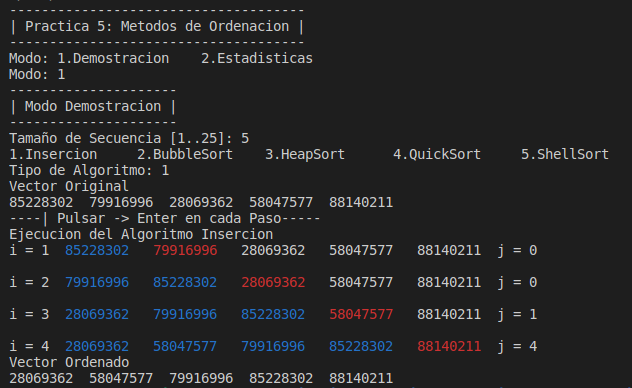
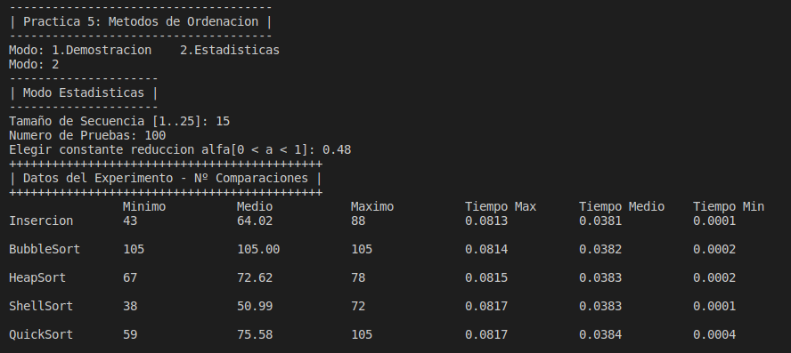

# Práctica 5 - ​Implementación de métodos de ordenación

En este programa podemos ver el funcionamiento y el rendimiento
de los siguientes algoritmos:
- [Insercion](../include/Insercion.h)
- [BubbleSort](../include/BubbleSort.h)
- [HeapSort](../include/HeapSort.h)
- [ShellSort](../include/ShellSort.h)
- [QuickSort](../include/QuickSort.h)

## Manual de Uso
``` 
 make
 make run
```

### Modo Demostracion
En este modo podremos ir ejecutando el algoritmo paso a paso.
Pulsando la tecla Enter


### Modo Estadisticas
